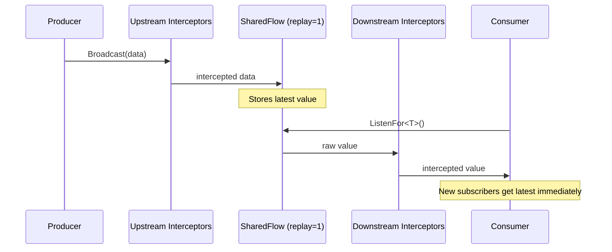
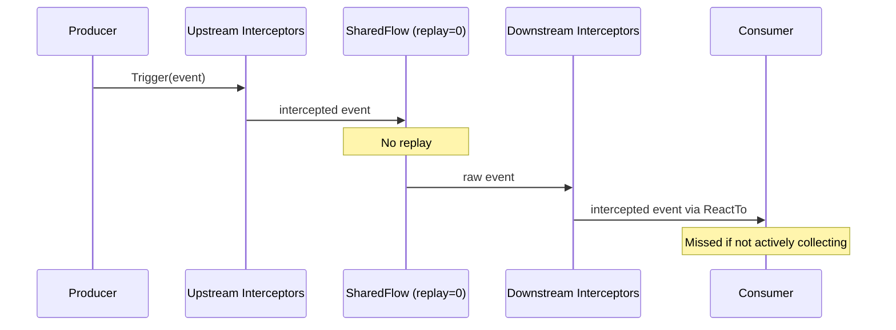
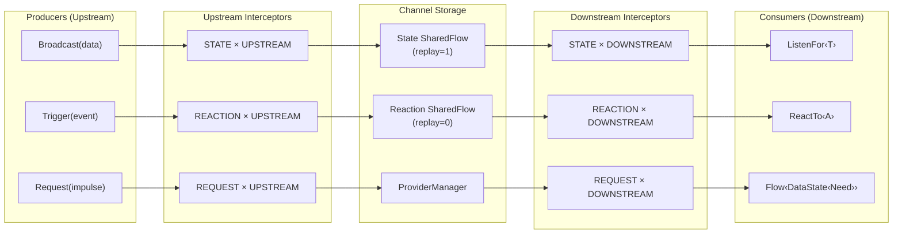

import Broadcast from '../../../assets/navigator-icons/broadcast.svg';
import Listen from '../../../assets/navigator-icons/listen.svg';
import Trigger from '../../../assets/navigator-icons/trigger.svg';
import React from '../../../assets/navigator-icons/react.svg';
import Request from '../../../assets/navigator-icons/request.svg';
import Provider from '../../../assets/navigator-icons/provider.svg';
import Interceptor from '../../../assets/navigator-icons/interceptor.svg';

The SwitchBoard routes three kinds of traffic. Every impulse in a Synapse app
travels on exactly one of them, and which channel you pick determines replay
semantics, who receives it, and what the lifecycle looks like.

| Channel      | Produce                          | Consume                                    | Purpose                                                                      |
|--------------|----------------------------------|--------------------------------------------|------------------------------------------------------------------------------|
| **State**    | <Broadcast /> `Broadcast(data)`  | <Listen /> `ListenFor<T> { ... }`          | Persistent state streams — new subscribers get the latest value              |
| **Reaction** | <Trigger /> `Trigger(event)`     | <React /> `ReactTo<A> { ... }`             | Fire-and-forget events — only active collectors receive them                 |
| **Request**  | <Request /> `Request(impulse)`   | <Provider /> `@SynapseProvider` class      | Data fetching via Providers — full `Loading` / `Success` / `Error` lifecycle |

## State

The State channel is for facts — values other components need to be able to
read. Session information, the logged-in account, the active theme, the
currently-selected workspace. A component <Broadcast /> `Broadcast`s a fact, and any
component that cares can <Listen /> `ListenFor` it and receive both the current value
and any future updates.

```kotlin
// Producer — the component that owns the fact
scope.launch { Broadcast(SessionState.Authenticated(user)) }

// Consumer — any component that needs the current session
ListenFor<SessionState> { session ->
    update { it.copy(session = session) }
}
```

State is keyed by type. A new <Broadcast /> `Broadcast<T>` replaces the previous value for
that type, so if you need multiple independent facts of the same shape, wrap
them in distinct types rather than reusing one.

The channel is backed by a `SharedFlow(replay = 1)`, so a new <Listen /> `ListenFor`
subscriber gets the latest value immediately — even if it mounted long
after the <Broadcast /> `Broadcast` was fired:



**Use State when:** the value represents a fact that other components in the
app need to be able to read. Session, config, feature flags,
currently-selected entity.

## Reaction

The Reaction channel is for things that happen. Button clicks, navigation,
refresh requests, form submissions, user gestures — one-shot events that one
component fires and another handles. A component <Trigger /> `Trigger`s an event, and any
component currently listening with <React /> `ReactTo` handles it.

```kotlin
// Producer — a click handler in a child composable
Button(onClick = {
    scope.launch { Trigger(Checkout.Submit(addressId)) }
}) { Text("Place Order") }

// Consumer — the checkout node
ReactTo<Checkout.Submit> { submit ->
    update { it.copy(isSubmitting = true) }
    scope.launch { /* ... */ }
}
```

Reactions don't stick around. If nothing is listening when you Trigger, the
event is gone — and that's exactly why the channel is safe for things you
would never want to repeat. A `Refresh` that re-fired every time a component
mounted would fetch forever; a `NavigateTo("login")` that re-fired would
bounce the user every time a screen appeared. Reactions are the right channel
for "this happened, react if you care."

The channel is backed by a `SharedFlow(replay = 0)`, so late subscribers
see nothing — they only receive events fired *after* they started
collecting:



**Use Reaction when:** the impulse describes something happening. `Refresh`,
`Submit`, `Logout`, `NavigateTo`, `ItemAddedToCart`.

## Request

The Request channel is how data enters the app. You fire a `DataImpulse<Need>`,
a matching <Provider /> `Provider` runs, and subscribers observe the full lifecycle as a
`Flow<DataState<Need>>` — `Idle`, `Loading`, `Success(data)`, or `Error(t)`.
A subscriber joining an in-progress fetch observes its current phase instead
of kicking off a duplicate.

```kotlin
// Define the impulse and the shape of the data it requests
data class FetchProfile(val userId: String) : DataImpulse<Profile>()

// Fire + consume in one call — the Node observes the full DataState lifecycle
Request(FetchProfile(userId)) { dataState ->
    update { it.copy(profile = dataState) }
}
```

The fetch itself lives in a <Provider /> `Provider`, wired via KSP and resolved through
your DI container. Nodes and Coordinators never touch the provider directly —
they fire a `DataImpulse`, and the SwitchBoard routes it through the
<Provider /> `ProviderManager`, through any `REQUEST` interceptors, and back out as
`DataState<Need>`.

The <Request /> `Request` DSL inside a Node takes an optional `key`. When the key changes,
the subscription is canceled and the fetch re-runs. This is how you express
"refetch when this parameter changes":

```kotlin
Request(FetchProfile(state.userId), key = state.lastRefresh) { dataState ->
    update { it.copy(profile = dataState) }
}
```

**Use Request when:** the answer lives outside the app and needs a loading
state. API calls, database reads, cached fetches.

## How it fits together

Producers emit on one of three channels. Interceptors run upstream and
downstream of each channel. Consumers subscribe by type — they never hold
references to producers.



Each channel has a matched pair of interceptor slots — upstream (before the
value lands in storage) and downstream (before it reaches the consumer). That
gives six well-defined extension points for cross-cutting concerns like auth
token injection, analytics capture, and request logging. Interceptors get
their own page later.

## Picking a channel

Pick the channel based on what the impulse *is*.

- **Reaction** — things that *happen*. Button clicks, navigation, refresh
  requests, submitted forms, user gestures, one-shot events. If you'd describe
  it with a verb, it's almost certainly a reaction.
- **State** — facts that need to be *readable* by other components. Session
  info, the logged-in account, the active theme, the currently-selected
  workspace. Anything a component needs to know the current value of.
- **Request** — information that isn't readily available and has to be
  *fetched*. Database reads, network calls, anything with a loading/success/
  error lifecycle.

## Next

- [Compose DSL](/arch/compose-dsl/) — `CreateContext`, `Node`, and `NodeScope`
