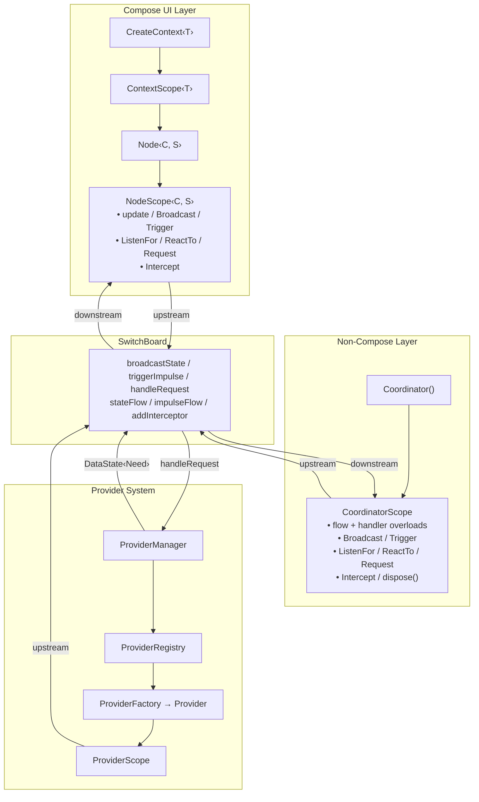

import Broadcast from '../../../assets/navigator-icons/broadcast.svg';
import Listen from '../../../assets/navigator-icons/listen.svg';
import Trigger from '../../../assets/navigator-icons/trigger.svg';
import React from '../../../assets/navigator-icons/react.svg';
import Request from '../../../assets/navigator-icons/request.svg';
import Provider from '../../../assets/navigator-icons/provider.svg';
import Interceptor from '../../../assets/navigator-icons/interceptor.svg';

A `Coordinator` is the non-Compose counterpart to a `Node`. It gives you
<Broadcast /> `Broadcast`, <Trigger /> `Trigger`, <Listen /> `ListenFor`, <React /> `ReactTo`, <Request /> `Request`, and <Interceptor /> `Intercept` —
the same DSL you have inside a Node — bound to a `LifecycleOwner` instead of
a composition. Use coordinators for work that outlives a single screen or
never had a composition to begin with: auth flows, cart management, session
tracking, analytics, background sync, push notification handling.

## How it fits alongside Nodes and Providers

`NodeScope`, `CoordinatorScope`, and <Provider /> `ProviderScope` are three different
surfaces onto the same bus. They differ in what owns their lifetime — a
composition, a `LifecycleOwner`, or a provider job — but each one reaches
the `SwitchBoard` through the same upstream/downstream interceptor pipeline,
and each one gets the same consumption methods:



The practical consequence is that you never reach for a "communication
layer" between Nodes and Coordinators. If a Node triggers an impulse, any
coordinator with a matching <React /> `ReactTo` handles it. If a coordinator
broadcasts a fact, any Node with <Listen /> `ListenFor` picks it up. Providers fulfill
<Request /> `Request` calls regardless of which scope initiated them, and can turn
around and <Listen /> `ListenFor`/<React /> `ReactTo` their own dependencies.

## Creating one

```kotlin
val coordinator = Coordinator(switchboard, lifecycleOwner) {
    ListenFor<AppConfig> { config ->
        applyConfig(config)
    }

    ReactTo<SessionExpired> {
        launch { Trigger(NavigateToLogin) }
    }

    Intercept<AnalyticsEvent>(
        point = InterceptPoint(Channel.REACTION, Direction.UPSTREAM),
        interceptor = Interceptor.read { event -> analytics.track(event) },
    )
}
```

`Coordinator(...)` is a top-level function, not a class constructor. It
builds a `CoordinatorScope` and runs the `block` with it as the receiver
*synchronously*, so every listener, interceptor, and lifecycle hook is wired
up before the function returns.

The coordinator auto-disposes when the `LifecycleOwner` reaches
`ON_DESTROY`. You can also call `coordinator.dispose()` manually for earlier
cleanup — it's idempotent.

Optional `tag` parameter enables tracing:

```kotlin
val coordinator = Coordinator(switchboard, lifecycleOwner, tag = "AuthCoordinator") { ... }
```

## `CoordinatorScope`

Inside a `Coordinator { ... }` block, `this` is a `CoordinatorScope`. It
exposes the same cross-bus capabilities as `NodeScope` (minus local state,
since there's no composition to manage), plus lifecycle hooks and a
different shape for consumption methods.

**Capabilities:**

| Category              | Method                                      | Returns                              |
|-----------------------|---------------------------------------------|--------------------------------------|
| **State broadcast**   | <Broadcast /> `Broadcast(data)`                           | suspend                              |
| **Reactions**         | <Trigger /> `Trigger(event)`                            | suspend                              |
| **Interception**      | <Interceptor /> `Intercept(point, interceptor, priority)`   | `Registration`                       |
| **Listen (state)**    | <Listen /> `ListenFor<O> { ... }` / <Listen /> `ListenFor<O>()`   | `Job` / `SharedFlow<O>`              |
| **Listen (reaction)** | <React /> `ReactTo<A> { ... }` / <React /> `ReactTo<A>()`       | `Job` / `SharedFlow<A>`              |
| **Request**           | <Request /> `Request(impulse) { ... }` / <Request /> `Request(impulse)` | `Job` / `Flow<DataState<Need>>`  |
| **Lifecycle hooks**   | `onCreate` / `onStart` / `onResume` / `onPause` / `onStop` / `onDestroy` | `Unit` |

`CoordinatorScope` implements `CoroutineScope` by delegation, so standard
coroutine builders (`launch`, `async`, `withContext`, …) are available
directly on the scope and inside every handler body. You don't need to
capture an outer scope.

```kotlin
Coordinator(switchboard, lifecycleOwner) {
    ReactTo<DataRefreshRequested> {
        launch {
            val data = fetchLatest()
            Broadcast(data)
        }
    }
}
```

## Flow vs handler overloads

Every consumption method has two forms:

| Form        | Shape                                 | When to use                                                             |
|-------------|---------------------------------------|-------------------------------------------------------------------------|
| **Handler** | <Listen /> `ListenFor<T> { handler }` → `Job`    | You just want to react to each value. Returns a `Job` you can cancel.    |
| **Flow**    | <Listen /> `ListenFor<T>()` → `SharedFlow<T>`    | You need to compose, filter, combine, debounce, or otherwise transform. |

The flow overloads are how you use operators like `combine`, `filter`, and
`debounce` across multiple bus sources:

```kotlin
Coordinator(switchboard, lifecycleOwner) {
    val configFlow = ListenFor<AppConfig>()
    val flagsFlow = ListenFor<FeatureFlags>()

    launch {
        combine(configFlow, flagsFlow) { config, flags ->
            resolveSettings(config, flags)
        }.collectLatest { settings ->
            Broadcast(settings)
        }
    }
}
```

Handler overloads run their callback with `CoordinatorScope` as the
receiver, so <Broadcast /> `Broadcast`, <Trigger /> `Trigger`, `launch`, and everything else on the
scope are available directly inside the handler.

## Lifecycle hooks

Register callbacks for any Android lifecycle event directly inside the
coordinator block:

```kotlin
Coordinator(switchboard, lifecycleOwner) {
    onStart {
        launch { Broadcast(SessionActive) }
    }

    onStop {
        launch { Broadcast(SessionInactive) }
    }
}
```

Available hooks: `onCreate`, `onStart`, `onResume`, `onPause`, `onStop`,
`onDestroy`. Multiple callbacks for the same event execute in registration
order. All callbacks are cleared on `dispose()`.

`onDestroy` fires *before* the auto-dispose, so use it for additional
cleanup that goes beyond what `dispose()` handles — closing external
resources, flushing caches, etc.

## How it works

`CoordinatorScope` is a `CoroutineScope` in its own right. In its
constructor it creates a `SupervisorJob` parented to
`owner.lifecycleScope.coroutineContext[Job]`, and delegates `coroutineContext`
to `owner.lifecycleScope.coroutineContext + job`. The supervisor parenting
is deliberate: calling `dispose()` manually only cancels the coordinator's
own job (and its children) — not the entire lifecycle scope, so other work
tied to the same `LifecycleOwner` keeps running.

In its init block the scope registers a `DefaultLifecycleObserver` on the
owner's lifecycle. Each overridden callback (`onStart`, `onStop`, …)
dispatches any user-registered callbacks for that event in registration
order. `onDestroy` additionally calls `dispose()`.

`dispose()` does four things:

1. **Cancels** the backing supervisor job, which cancels every handler
   coroutine and in-flight request launched by the scope.
2. **Unregisters** every interceptor added via <Interceptor /> `Intercept`. Registrations
   are accumulated in an internal list as they're added.
3. **Clears** the internal registration and lifecycle-callback lists.
4. **Removes** the lifecycle observer from the `LifecycleOwner`.

It's idempotent — safe to call multiple times — and after it runs, the
scope is no longer usable. Coroutines started via `launch` / `async` on a
disposed scope return immediately in a cancelled state: their bodies do
not execute past the first suspension point, and the builder itself does
not throw.

The handler overloads are trivially thin: each one is `launch { flow.collect
{ handler(it) } }` (or `collectLatest` for state), so the returned `Job` is
a child of the coordinator's supervisor job and is canceled automatically
on dispose. You can also cancel an individual `Job` early to unsubscribe
without disposing the whole scope.

## Patterns

Coordinators handle business logic that spans multiple screens or lives
beyond a single composition.

- **Cross-cutting concerns** — auth token injection, session management,
  analytics
- **Background work** — sync jobs, push notification handling
- **Multi-screen orchestration** — cart management, onboarding flows

### The Hilt-friendly scaffold

A concrete coordinator usually has dependencies that come from Hilt (APIs,
repositories, caches) and needs a `SwitchBoard` to actually wire itself up.
These arrive in different phases — Hilt can construct the coordinator with
its dependencies up front, but the switchboard only exists once the DI graph
is ready. The common pattern is a small app-side `BaseCoordinator` interface
plus a tiny default implementation, so concrete coordinators can pick up the
behavior via Kotlin's interface delegation (`by`):

```kotlin
interface BaseCoordinator {
    fun initialize(switchBoard: SwitchBoard)
}

class LifecycleCoordinator(
    private val owner: LifecycleOwner,
    private val setup: CoordinatorScope.() -> Unit,
) : BaseCoordinator {
    override fun initialize(switchBoard: SwitchBoard) {
        Coordinator(switchBoard, owner) { setup() }
    }
}
```

`BaseCoordinator` is **not** part of the framework — it's a small scaffold
you drop into your own app. The interface exposes `initialize(switchBoard)`
as the single entry point once the bus exists; `LifecycleCoordinator` is the
default implementation that takes a `LifecycleOwner` and a `setup` block and
wires them up when `initialize` fires. Concrete coordinators delegate to it
with `by`, which keeps the subclass itself free of any scaffolding.

There's no explicit `dispose()` — the `CoordinatorScope` auto-disposes when
the `LifecycleOwner` reaches `ON_DESTROY`, so the scaffold doesn't need to
hold on to the scope or expose a teardown hook.

### A concrete coordinator

Concrete coordinators are `@Singleton`s with an `@Inject` constructor, and
they delegate `BaseCoordinator` to a `LifecycleCoordinator` built inline:

```kotlin
@Singleton
class CartCoordinator @Inject constructor(
    api: CartApi,
    lifecycleOwner: LifecycleOwner,
) : BaseCoordinator by LifecycleCoordinator(lifecycleOwner, {
    ReactTo<AddToCart> { impulse ->
        launch {
            try {
                api.addToCart(impulse.token, impulse.productId, impulse.quantity)
                Trigger(ShowToast("Added to cart"))
            } catch (e: Exception) {
                Trigger(ShowToast(e.message ?: "Failed to add to cart"))
            }
        }
    }

    ReactTo<UpdateCartQuantity> { impulse ->
        launch {
            try {
                api.updateCartQuantity(impulse.token, impulse.productId, impulse.quantity)
            } catch (e: Exception) {
                Trigger(ShowToast(e.message ?: "Failed to update cart"))
            }
        }
    }

    ReactTo<CheckoutRequested> { impulse ->
        launch {
            try {
                api.checkout(impulse.token, impulse.addressId)
                Trigger(OrderPlaced())
                Trigger(ShowToast("Order placed!"))
            } catch (e: Exception) {
                Trigger(ShowToast(e.message ?: "Checkout failed"))
            }
        }
    }
})
```

The setup block is a lambda passed to `LifecycleCoordinator` at construction
time; it closes over the injected `api` parameter directly, so no property
declaration is needed. Everything the coordinator does is expressed as
reactions, requests, and broadcasts on the bus. The only input the
coordinator has is the impulse types it consumes; the only output is the
impulse types it emits. Notice the shape: each handler just launches, tries
the operation, and either broadcasts / triggers success or triggers an error
impulse. That's the whole job.

### Choosing a lifecycle

A coordinator's lifetime is whatever makes sense for the work it does.
Generally that's the longer-running of the two obvious options — the
application process or the activity — depending on the concern.

- **Application-scoped** — auth, session tracking, cart, analytics, any
  cross-cutting coordinator that should survive navigation between
  activities. Use `ProcessLifecycleOwner` as the `LifecycleOwner` and
  `@Singleton` on the coordinator.
- **Activity-scoped** — coordinators that only make sense while a specific
  activity is alive. Use the activity itself as the `LifecycleOwner` under a
  Hilt activity-retained component.
- **Fragment-scoped** — finer-grained still, when the concern is narrower
  than the activity but wider than a single composition. Valid, just less
  common.
- **View-scoped** — possible, but not recommended. At that granularity a
  `Node` is almost always the better tool.

The `LifecycleCoordinator` scaffold above is lifetime-agnostic: it takes a
`LifecycleOwner` and forwards it to `Coordinator(...)`. What determines the
coordinator's actual lifetime is which `LifecycleOwner` you hand it and
which Hilt scope you put the implementing class in.

### Bootstrapping (application-scoped)

For the most common case — an app-wide coordinator — provide
`ProcessLifecycleOwner` as the `LifecycleOwner` through Hilt. It tracks the
whole app process, which matches a `@Singleton` coordinator:

```kotlin
@Module
@InstallIn(SingletonComponent::class)
object CoordinatorModule {
    @Provides
    @Singleton
    fun provideLifecycleOwner(): LifecycleOwner = ProcessLifecycleOwner.get()
}
```

Inject the `SwitchBoard` and every coordinator into your `Application`
class, then call `initialize(switchBoard)` on each in `onCreate`:

```kotlin
@HiltAndroidApp
class MainApplication : Application() {

    @Inject lateinit var switchBoard: SwitchBoard

    @Inject lateinit var authCoordinator: AuthCoordinator
    @Inject lateinit var cartCoordinator: CartCoordinator
    @Inject lateinit var favoritesCoordinator: FavoritesCoordinator
    // … etc.

    override fun onCreate() {
        super.onCreate()
        authCoordinator.initialize(switchBoard)
        cartCoordinator.initialize(switchBoard)
        favoritesCoordinator.initialize(switchBoard)
    }
}
```

That's the entire wire-up. No teardown override is needed — each
coordinator auto-disposes when `ProcessLifecycleOwner` reaches `ON_DESTROY`,
which cancels its supervisor job, unregisters its interceptors, and removes
its lifecycle observer. Once `initialize` runs, each coordinator's
`setup()` installs its listeners on the real switchboard and the coordinator
starts reacting to impulses.

### Advanced: interceptors and closure state

For more involved coordinators, the setup block can hold closure-scoped
mutable state and install interceptors alongside its listeners. The demo's
`AuthCoordinator` uses this pattern to cache the current token and inject
it into every outgoing token-bearing impulse:

```kotlin
@Singleton
class AuthCoordinator @Inject constructor(
    auth: AuthApi,
    lifecycleOwner: LifecycleOwner,
) : BaseCoordinator by LifecycleCoordinator(lifecycleOwner, {
    var currentToken: String? = null

    // Inject the current token into every outgoing TokenBearer impulse,
    // on both the reaction and request channels
    Intercept<TokenBearer>(
        point = InterceptPoint(Channel.REACTION, Direction.UPSTREAM),
        interceptor = Interceptor.transform { it.apply { token = currentToken } },
    )
    Intercept<TokenBearer>(
        point = InterceptPoint(Channel.REQUEST, Direction.UPSTREAM),
        interceptor = Interceptor.transform { it.apply { token = currentToken } },
    )

    ReactTo<LoginRequested> { impulse ->
        launch {
            try {
                val result = auth.login(impulse.email, impulse.password)
                currentToken = result.token.accessToken
                Broadcast<SessionState>(SessionState.Authenticated(result.token, result.user))
                Trigger(AuthSuccess())
            } catch (e: Exception) {
                Trigger(AuthError(e.message ?: "Login failed"))
            }
        }
    }

    // … refresh, logout, register, cached-session restoration …
})
```

The `currentToken` variable is a regular `var` captured by the closures.
Because the setup block runs once during `initialize`, every handler closes
over the same variable, so reads and writes across handlers see each other's
updates. This is the idiomatic way to keep per-coordinator local state
without dragging in a node — closures are enough when there's no UI to
render.

### Prefer multiple focused coordinators

Each coordinator is a state machine with typed inputs and outputs. The
coupling between them is only the impulse types they share, which is the
entire point — it's what gives you compositional correctness. A god-object
`AppCoordinator` that does everything inside one `setup()` gives that up.

```kotlin
// Good: separate concerns
class AuthCoordinator(...)      // handles auth flow
class CartCoordinator(...)      // handles cart operations
class AnalyticsCoordinator(...) // handles event tracking

// Bad: god coordinator
class AppCoordinator(...)       // handles everything
```

## Next

- [Providers](/arch/providers/) — how <Request /> `Request` gets fulfilled
