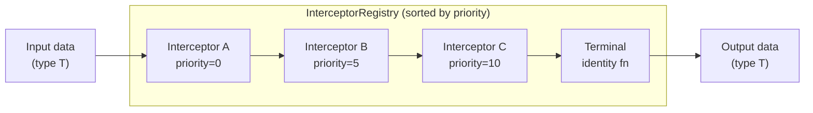

import Broadcast from '../../../assets/navigator-icons/broadcast.svg';
import Listen from '../../../assets/navigator-icons/listen.svg';
import Trigger from '../../../assets/navigator-icons/trigger.svg';
import React from '../../../assets/navigator-icons/react.svg';
import Request from '../../../assets/navigator-icons/request.svg';
import Provider from '../../../assets/navigator-icons/provider.svg';
import Interceptor from '../../../assets/navigator-icons/interceptor.svg';

Interceptors are middleware for the bus. An interceptor claims a type and
an intercept point, and whenever a value of that type passes through that
point, the interceptor gets a chance to look at it, transform it, or stop
it from going further. They're how you implement cross-cutting concerns
— token injection, analytics, logging, validation, auth gates — without
pushing that logic into every producer and consumer.

## Intercept points

An intercept point is a `(Channel, Direction)` pair. `Channel` is
`STATE`, `REACTION`, or `REQUEST`. `Direction` is `UPSTREAM` (producer
side — before the value enters the channel) or `DOWNSTREAM` (consumer
side — after the value leaves the channel, before it's delivered). That
gives you six named points in total:

| Point                   | Fires…                                                                        |
|-------------------------|-------------------------------------------------------------------------------|
| `STATE_UPSTREAM`        | Before a <Broadcast /> `Broadcast` value enters the state channel.                          |
| `STATE_DOWNSTREAM`      | Before a <Listen /> `ListenFor` collector receives a state value.                        |
| `REACTION_UPSTREAM`     | Before a <Trigger /> `Trigger` value enters the reaction channel.                         |
| `REACTION_DOWNSTREAM`   | Before a <React /> `ReactTo` collector receives a reaction.                             |
| `REQUEST_UPSTREAM`      | Before a <Request /> `Request` impulse routes to its provider.                            |
| `REQUEST_DOWNSTREAM`    | Before a `DataState` emission is delivered to a <Request /> `Request` caller.             |

Upstream points are the natural place for things that should affect
*every* consumer — rewriting outgoing impulses, stamping timestamps,
dropping events that fail validation. Downstream points are for things
that should affect *one specific consumer*, or that should see values as
they're about to be observed — per-consumer filtering, UI-layer
translation, decryption right before display.

The framework ships pre-allocated constants for all six so you don't
build the pair yourself:

```kotlin
InterceptPoint.REACTION_UPSTREAM
InterceptPoint.STATE_DOWNSTREAM
InterceptPoint.REQUEST_UPSTREAM
// …
```

## Installing an interceptor

You install interceptors through the same DSL entry point as the other
bus capabilities: <Interceptor /> `Intercept<T>(...)` inside a Node or Coordinator.
Registration is scoped to the component's lifetime — a Node interceptor
is removed when the Node leaves the composition, a Coordinator
interceptor is removed when the lifecycle owner reaches `ON_DESTROY`.
You don't track the registration yourself.

```kotlin
Coordinator(switchBoard, lifecycleOwner) {
    Intercept<AnalyticsEvent>(
        point = InterceptPoint.REACTION_UPSTREAM,
        interceptor = Interceptor.read { event -> analytics.track(event) },
    )
}
```

<Interceptor /> `Intercept` returns a `Registration` handle if you want to remove the
interceptor earlier than the default lifetime — handy for scoped
middleware like a logged-out auth gate that should only exist while the
session is invalid.

## The three shapes

Most interceptors take one of three forms, and the <Interceptor /> `Interceptor`
companion gives you factory helpers for each:

**<Interceptor /> `Interceptor.read`** — observation only. The block runs with the
current value and always passes it through unchanged. Use for logging,
metrics, analytics, anything that's a side effect but shouldn't touch
the data.

```kotlin
Intercept<OrderPlaced>(
    point = InterceptPoint.REACTION_UPSTREAM,
    interceptor = Interceptor.read { event -> analytics.track("order_placed", event.orderId) },
)
```

**<Interceptor /> `Interceptor.transform`** — rewrite the value. The block receives the
current value and returns the value that should continue down the
chain. Use for injection (stamping missing fields), normalization, or
sanitization.

```kotlin
Intercept<TokenBearer>(
    point = InterceptPoint.REACTION_UPSTREAM,
    interceptor = Interceptor.transform { it.apply { token = currentToken } },
)
```

**<Interceptor /> `Interceptor.full`** — arbitrary control. The block receives the
value and a `proceed` callback. You can transform before *and* after
proceeding, call `proceed` multiple times (retry), or skip it entirely
(short-circuit). Use for anything the other two can't express.

```kotlin
Intercept<SecureRequest>(
    point = InterceptPoint.REQUEST_UPSTREAM,
    interceptor = Interceptor.full { request, proceed ->
        if (!session.isValid()) {
            Trigger(SessionExpired)
            request // return the untouched request instead of calling proceed — short-circuit
        } else {
            proceed(request.copy(timestamp = clock.now()))
        }
    },
)
```

Under the hood all three are just <Interceptor /> `Interceptor<T>` — a functional
interface with a single `intercept(data, chain)` method. The factories
exist because the common cases have enough boilerplate that naming them
makes intent obvious at a glance.

## Priority and ordering

Every interceptor has an `Int` priority. **Lower values run first**;
ties break in FIFO insertion order. The default priority is `0`, which
is fine for most things — reach for priority only when you have
interceptors that genuinely need to stack in a specific order.

At any given intercept point, the pipeline is a chain: the input value
flows through each interceptor in priority order, each one deciding
whether to pass, transform, or short-circuit, and the final output is
whatever the last interceptor hands to the terminal identity function:



The registry finds every entry whose registered `KClass` is a supertype
of the incoming value, merges them, sorts by priority, and caches the
result — so the cost of dispatch is linear in the number of matching
interceptors, not in the total number of registrations.

```kotlin
// Logging sees raw data before anything else touches it
Intercept<OrderPlaced>(
    point = InterceptPoint.REACTION_UPSTREAM,
    priority = Int.MIN_VALUE,
    interceptor = Interceptor.read { log.d("raw: $it") },
)

// Normalization runs after logging, before business interceptors
Intercept<OrderPlaced>(
    point = InterceptPoint.REACTION_UPSTREAM,
    priority = -100,
    interceptor = Interceptor.transform { it.normalize() },
)
```

Priority is per-intercept-point. Interceptors at
`REACTION_UPSTREAM` never interleave with interceptors at
`REACTION_DOWNSTREAM` — they're different pipelines.

## Type matching and supertype interception

Interceptors are keyed by type, and the bus uses
`Class.isAssignableFrom` to match. That means an interceptor registered
on a supertype fires for **every subtype** as well, which is how the
`TokenBearer` pattern works:

```kotlin
interface TokenBearer { var token: String? }

data class PlaceOrder(val cart: Cart, override var token: String? = null) :
    Impulse(), TokenBearer

data class FetchProfile(val userId: Int, override var token: String? = null) :
    DataImpulse<UserProfile>(), TokenBearer

// One interceptor rewrites the token on every TokenBearer impulse,
// regardless of the concrete type
Intercept<TokenBearer>(
    point = InterceptPoint.REACTION_UPSTREAM,
    interceptor = Interceptor.transform { it.apply { token = currentToken } },
)
Intercept<TokenBearer>(
    point = InterceptPoint.REQUEST_UPSTREAM,
    interceptor = Interceptor.transform { it.apply { token = currentToken } },
)
```

Declare a marker interface, have every impulse that needs the
cross-cutting behavior implement it, and install one interceptor per
point. The concrete impulse types don't need to know the interceptor
exists.

## Patterns

### Short-circuit for auth gates

An interceptor that doesn't call `proceed` drops the value on the
floor. Combine that with a <Trigger /> `Trigger` inside the interceptor to turn a
dropped request into a redirect:

```kotlin
Intercept<SecureImpulse>(
    point = InterceptPoint.REQUEST_UPSTREAM,
    interceptor = Interceptor.full { impulse, proceed ->
        if (session.isValid()) {
            proceed(impulse)
        } else {
            Trigger(NavigateToLogin)
            impulse // returned but never forwarded — the Request flow just stalls in Loading
        }
    },
)
```

The call site stays clean — every <Request /> `Request(SecureImpulse(...))` either
fetches data or bounces to login, and no consumer has to check the
session itself.

### Analytics and logging

<Interceptor /> `Interceptor.read` at `REACTION_UPSTREAM` is the idiomatic analytics
hook — you see every user-intent event exactly once, right as it's
fired, before any downstream listener can mutate or filter it:

```kotlin
Intercept<AnalyticsEvent>(
    point = InterceptPoint.REACTION_UPSTREAM,
    interceptor = Interceptor.read { event -> analytics.track(event) },
)
```

For blanket logging of every event of a given type across all six
points, the framework ships `addLoggingInterceptors`:

```kotlin
switchBoard.addLoggingInterceptors<AnalyticsEvent> { event ->
    log.d("analytics: $event")
}
```

It installs six `read` interceptors, one per point, at priorities that
put upstream logging first and downstream logging last — so you get a
clean bracket around every pass through the bus.

### Per-consumer filtering at downstream

Downstream interceptors are the right place for filtering that should
affect one specific component. A Node that only cares about high-value
cart events can install a downstream filter that short-circuits the
rest:

```kotlin
Node(initialState = VipState()) {
    Intercept<CartUpdated>(
        point = InterceptPoint.REACTION_DOWNSTREAM,
        interceptor = Interceptor.full { update, proceed ->
            if (update.total >= VIP_THRESHOLD) proceed(update) else update
        },
    )

    ReactTo<CartUpdated> { /* only sees VIP updates */ }
}
```

Because the interceptor is installed from inside the Node, it's
automatically unregistered when the Node leaves the composition — no
stale filter lying around affecting other screens.

## Next

- [Organizing Impulses & State](/arch/organizing/) — how to scope impulse types across features
