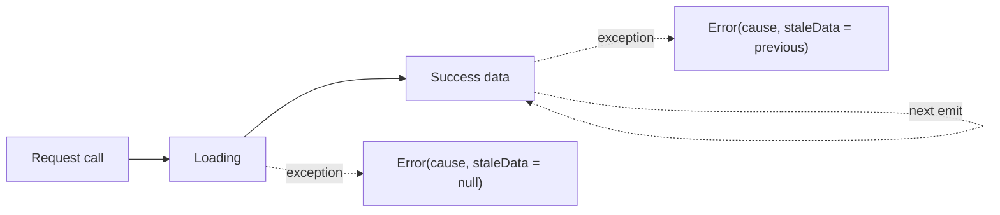
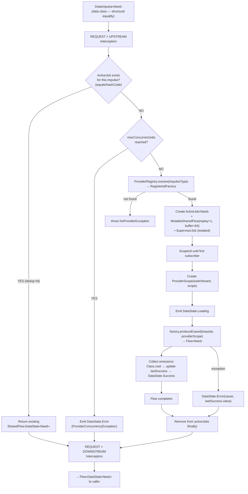

import Broadcast from '../../../assets/navigator-icons/broadcast.svg';
import Listen from '../../../assets/navigator-icons/listen.svg';
import Trigger from '../../../assets/navigator-icons/trigger.svg';
import React from '../../../assets/navigator-icons/react.svg';
import Request from '../../../assets/navigator-icons/request.svg';
import Provider from '../../../assets/navigator-icons/provider.svg';
import Interceptor from '../../../assets/navigator-icons/interceptor.svg';

When a Node or Coordinator calls <Request /> `Request(SomeImpulse)`, the bus itself
doesn't know how to fetch anything — it just routes the request. Providers
are the other half: each one is a small class bound to exactly one
`DataImpulse` type that knows how to produce the data it asks for. The
framework instantiates a provider on demand, wraps its output in
`DataState`, and tears it down when nobody's listening.

## `DataImpulse`

A `DataImpulse<Need>` is both the request definition and the type-safe link
to its result. The generic parameter declares what the caller expects back,
and subclassing as a `data class` makes structural equality drive request
deduplication:

```kotlin
data class FetchProduct(val productId: String) : DataImpulse<Product>()
data class ObserveCart(val userId: String) : DataImpulse<List<CartItemWithProduct>>()
```

Two impulses that compare equal are treated as the same request and share
the same in-flight job. `FetchProduct("sku-42")` fired from a product
detail screen and again from a "you might also like" carousel runs exactly
once — both callers collect the same flow.

Because `Need` is declared on the impulse itself, <Request /> `Request(FetchProduct(id))`
infers its result type as `Flow<DataState<Product>>`. You never specify it
at the call site, and the compiler can't let you ask for the wrong one.

## Writing a provider

A provider subclasses <Provider /> `Provider<I, Need>` and overrides a single method:
`produce(impulse: I)`. The return type is `Flow<Need>`. For one-shot
fetches, use `flow { emit(...) }`. For observations, return the underlying
flow directly.

**One-shot fetch** — run once and emit a single value:

```kotlin
@SynapseProvider
class ProductDetailProvider @Inject constructor(
    private val api: MarketApi,
) : Provider<FetchProduct, Product>() {
    override fun ProviderScope.produce(impulse: FetchProduct): Flow<Product> = flow {
        emit(api.getProduct(impulse.productId))
    }
}
```

**Streaming / observation** — delegate to an underlying flow:

```kotlin
@SynapseProvider
class CartProvider @Inject constructor(
    private val api: MarketApi,
) : Provider<ObserveCart, List<CartItemWithProduct>>() {
    override fun ProviderScope.produce(impulse: ObserveCart): Flow<List<CartItemWithProduct>> =
        api.observeCartWithProducts(impulse.userId)
}
```

**Parallel composition** — fan out, await, emit once:

```kotlin
@SynapseProvider
class HomeProductsProvider @Inject constructor(
    private val api: MarketApi,
) : Provider<FetchHomeProducts, HomeProducts>() {
    override fun ProviderScope.produce(impulse: FetchHomeProducts): Flow<HomeProducts> = flow {
        coroutineScope {
            val personalized = async { api.getPersonalizedProducts(impulse.token, 20) }
            val onSale = async { api.getOnSale(8) }
            val topRated = async { api.getTopRated(20) }
            emit(
                HomeProducts(
                    personalized = personalized.await(),
                    onSale = onSale.await(),
                    topRated = topRated.await(),
                )
            )
        }
    }
}
```

Concrete providers are regular Kotlin classes with `@Inject` constructors.
Hilt constructs them, KSP registers them (more on that in a moment), and
there's no base wiring you need to touch beyond the <Provider /> `Provider` superclass.

## <Provider /> `ProviderScope`

`produce` is an extension function on <Provider /> `ProviderScope`, which gives the
provider access to the rest of the bus. Like `CoordinatorScope` and
`NodeScope`, it exposes the usual capabilities — plus nested requests so
providers can depend on each other's data.

**Capabilities:**

| Category               | Method                  | Returns                     |
|------------------------|-------------------------|-----------------------------|
| **State observation**  | <Listen /> `ListenFor<O>()`        | `SharedFlow<O>`             |
| **Reaction observation** | <React /> `ReactTo<A>()`        | `SharedFlow<A>`             |
| **State broadcast**    | <Broadcast /> `Broadcast(data)`       | suspend                     |
| **Reaction trigger**   | <Trigger /> `Trigger(event)`        | suspend                     |
| **Nested request**     | <Request /> `Request(impulse)`      | `Flow<DataState<Need>>`     |

<Provider /> `ProviderScope` implements `CoroutineScope` by delegation, so `launch`,
`async`, and `coroutineScope` are available directly inside `produce`. The
backing scope is managed by the framework — it's canceled when the
provider is disposed, so any work launched through it stops automatically.

**Nested requests** let one provider depend on another provider's data:

```kotlin
override fun ProviderScope.produce(impulse: FetchSecureData): Flow<SecurePayload> = flow {
    val token = Request(FetchCachedToken())
        .filterIsInstance<DataState.Success<AuthToken>>()
        .first()
        .data
    emit(api.fetch(impulse.endpoint, token.accessToken))
}
```

Most providers don't need bus access at all — they take their dependencies
from DI and return a flow. Reach for <Provider /> `ProviderScope`'s capabilities only
when a provider genuinely needs to compose with other bus traffic.

## <Provider /> `@SynapseProvider` and registration

Every concrete provider is annotated <Provider /> `@SynapseProvider`. A KSP processor
walks every annotated class at compile time, validates that:

- The class extends <Provider /> `Provider<I, Need>` directly
- The type arguments are concrete (no raw types, no type variables)
- No two providers claim the same `DataImpulse` type

…and generates a Hilt `@Module` in `SingletonComponent` that assembles a
<Provider /> `ProviderRegistry`. Each provider is injected as a `javax.inject.Provider<T>`
so Hilt can construct fresh instances on demand, and
<Provider /> `ProviderRegistry.Builder` wires each one to its impulse type:

```kotlin
// Generated — do not edit
@Module
@InstallIn(SingletonComponent::class)
object SynapseProviderModule_App {
    @Provides @Singleton
    fun provideRegistry(
        productDetailProvider: javax.inject.Provider<ProductDetailProvider>,
        cartProvider: javax.inject.Provider<CartProvider>,
        // … one entry per @SynapseProvider class
    ): ProviderRegistry = ProviderRegistry.Builder()
        .register(
            impulseType = FetchProduct::class,
            needClass = Product::class.java,
            factory = ProviderFactory { productDetailProvider.get() },
        )
        .register(
            impulseType = ObserveCart::class,
            needClass = List::class.java as Class<List<CartItemWithProduct>>,
            factory = ProviderFactory { cartProvider.get() },
        )
        // …
        .build()
}
```

The `SwitchBoard` takes the <Provider /> `ProviderRegistry` as a constructor dependency,
so once Hilt has built the registry, every <Request /> `Request(FetchProduct(id))` call
flows through it to the right factory. You never touch <Provider /> `ProviderRegistry`
directly except in tests.

A missing provider is a compile error — KSP refuses to generate the module
if a <Provider /> `@SynapseProvider` class is malformed. In the unusual case where a
`DataImpulse` is dispatched at runtime with no registered handler (e.g.,
because the provider lives in a module that wasn't included in this build),
the request surfaces `NoProviderException` instead of silently hanging.

## The `DataState` lifecycle

Callers don't see raw values — every provider's output is wrapped in
`DataState<Need>`, a sealed type that captures the full fetch lifecycle:

| State                       | When                                                                 |
|-----------------------------|----------------------------------------------------------------------|
| `Idle`                      | No request has been made yet. Default before activation — not emitted by providers themselves. |
| `Loading`                   | Before `produce` emits its first value.                              |
| `Success(data)`             | Each value the provider emits.                                       |
| `Error(cause, staleData)`   | Any uncaught exception. Carries the last successful value if one existed. |

The sequence is always the same:



Streaming providers stay in `Success` as long as they keep emitting, drop
to `Error` if the underlying flow throws (carrying the last successful
value forward as `staleData`), and recover back to `Success` on the next
successful emission. One-shot providers go `Loading → Success` or
`Loading → Error` and then complete.

Consumers typically read the state with `dataOrNull` or a `when` branch:

```kotlin
Node(initialState = ProductScreenState()) {
    Request(FetchProduct(productId)) { dataState ->
        update { it.copy(productState = dataState) }
    }

    when (val s = state.productState) {
        DataState.Idle, DataState.Loading -> Spinner()
        is DataState.Success -> ProductView(s.data)
        is DataState.Error -> ErrorBanner(s.cause, stale = s.staleData)
    }
}
```

## Deduplication and lifecycle

When <Request /> `Request(FetchProduct("sku-42"))` arrives at the bus, the
<Provider /> `ProviderManager` checks whether an active job already exists for that
impulse, keyed by structural equality. If one does, the existing flow is
returned — no new work is started, no new <Provider /> `Provider` instance is
constructed, and both callers see the same emissions.

If no matching job exists, the manager:

1. Resolves the registered <Provider /> `ProviderFactory` from the registry.
2. Creates a fresh <Provider /> `Provider` instance via the factory.
3. Waits until something actually subscribes, then emits `Loading`.
4. Runs `produce`, collecting its flow, and emits each value as `Success`.
5. On completion (success or error), removes the job from the active table
   so a future request starts cleanly.

The "wait until something subscribes" step matters: a <Request /> `Request` call does
no work until its returned flow is actually collected. And because the
underlying flow retains its most recent `DataState`, a subscriber that
arrives after the first emission still sees the latest value immediately.

The provider *instance itself* is throwaway. It's created when the job
starts and garbage-collected when the job ends. There's no long-lived
provider you can hold a reference to — that's intentional. Any state that
needs to outlive a single request belongs in the injected dependencies
(a cache, a DAO, a repository), not in the provider.

The full internal path from a <Request /> `Request` call to the emitted
`Flow<DataState<Need>>` — including dedup, concurrency gating, factory
resolution, the first-subscriber wait, collection, and cleanup — looks
like this:



Most of that machinery is invisible to callers — the diagram exists so
that when you do need to reason about dedup, cleanup ordering, or the
"last successful value" stash on `DataState.Error`, the mental model
matches what's actually happening.

## Freshness windows

Bus dedup only covers *overlapping* requests — two callers firing the
same impulse while the fetch is in flight share one job. Once that job
completes, the next <Request /> `Request` starts from scratch. A
<Provider /> `Provider` never caches its own results.

For data that's expensive to refetch but safe to reuse for a bounded
window — a user profile, a feature config, a catalog page — use
`FreshnessRegistry` to mint a stable token for that window and key a
cache by it.

### `FreshnessKey` and `FreshnessRegistry`

A `FreshnessKey` binds a logical cache entry to how long it stays fresh:

```kotlin
data class ProductBucket(val productId: String) : FreshnessKey {
    override val duration: Duration = 5.minutes
}
```

Hold a `FreshnessRegistry<ProductBucket>` as a singleton. Every call to
`get(key)` within the same 5-minute window returns the identical
`FreshnessToken`; the next call after the window opens a new bucket and
issues a new token.

```kotlin
@Module
@InstallIn(SingletonComponent::class)
object FreshnessModule {
    @Provides @Singleton
    fun productFreshness() = FreshnessRegistry<ProductBucket>(maxSize = 500)
}
```

`maxSize` caps the registry for user-generated key spaces. When the map
is full, inserting a new key evicts the bucket nearest to expiring — a
min-heap keeps that lookup O(log n) regardless of how mixed the
durations are.

### Keying a cache by token

The token is opaque on purpose. Its only contract is *stable within a
window, different across windows*, which makes it a safe component of a
cache key in whatever storage the provider sits in front of:

```kotlin
@SynapseProvider
class ProductDetailProvider @Inject constructor(
    private val api: MarketApi,
    private val freshness: FreshnessRegistry<ProductBucket>,
    private val cache: ProductCache,
) : Provider<FetchProduct, Product>() {
    override fun ProviderScope.produce(impulse: FetchProduct): Flow<Product> = flow {
        val token = freshness.get(ProductBucket(impulse.productId))
        emit(cache.getOrPut(impulse.productId, token) { api.getProduct(impulse.productId) })
    }
}
```

Where `ProductCache` is a thin memory map:

```kotlin
@Singleton
class ProductCache @Inject constructor() {
    private val entries = ConcurrentHashMap<Pair<String, FreshnessToken>, Product>()
    inline fun getOrPut(
        id: String,
        token: FreshnessToken,
        load: () -> Product,
    ): Product = entries.getOrPut(id to token, load)
}
```

Within the window every fetch hits the cache. Once the window rolls
over, the token changes, the `(id, token)` pair misses, and
`api.getProduct` runs once — its result then serves the next window.

Bus dedup compounds this: if three callers simultaneously request the
same product on a cold cache, they share a single `produce` run and only
one `api.getProduct` call is made.

### Choosing a duration

Pick the duration from how stale the *user* will tolerate the data
being, not from how expensive the fetch is:

- **Seconds** for things that should feel live (cart badges, order status).
- **Minutes** for things that are effectively static within a session (catalog entries, profile).
- **Hours** for things that only change on explicit user action (feature flags, saved preferences).

Calls fired more often than the duration coalesce onto the cache; calls
fired less often always refetch, so a long duration on an infrequent
request buys nothing.

### One registry per key type, or one per scope?

Per-type is the right default. Each registry is cheap — a `HashMap`, a
min-heap, and a counter — and splitting gives you an independent
`maxSize` budget, targeted `clear()`, and type-safe DI. Mixing unrelated
keys in a single pool lets a burst of product lookups evict your
feature-flag buckets, because the heap evicts by expiry and knows
nothing about which concern a key belongs to.

Merge registries when a set of key types share both a duration profile
and an invalidation trigger — everything user-scoped that should drop on
sign-out, say. Define a sealed parent and let `FreshnessRegistry` take
the parent type:

```kotlin
sealed interface UserScopedKey : FreshnessKey {
    data class Profile(val userId: String) : UserScopedKey { override val duration = 5.minutes }
    data class Cart(val userId: String)    : UserScopedKey { override val duration = 30.seconds }
    data class Orders(val userId: String)  : UserScopedKey { override val duration = 2.minutes }
}

// One registry, one clear() call on sign-out.
FreshnessRegistry<UserScopedKey>(maxSize = 1_000)
```

Past that, an app-wide registry tends to blur eviction and invalidation
semantics without saving much.

### Invalidation

`FreshnessRegistry.clear()` drops every bucket regardless of expiry.
Call it on sign-out, tenant switch, or any transition that should
invalidate every cached view at once. For targeted invalidation, evict
from the downstream cache directly — the token itself carries no state
beyond its window.

## Testing

The `arch-test` module ships a `SynapseTestRule` that stands up a real
`SwitchBoard` for a test and lets you stub providers inline via a small
DSL. You don't hand-build a <Provider /> `ProviderRegistry` or uninstall the generated
Hilt module — the rule does it for you:

```kotlin
@get:Rule
val synapse = SynapseTestRule {
    // Single-value provider — wraps the returned value in a one-shot flow
    provide<List<Address>, FetchAddresses> { testAddresses }

    // Emits nothing — returning null produces an empty flow
    provide<AuthToken, FetchCachedToken> { null }

    // Streaming / multi-emission provider
    provideFlow<List<Product>, FetchProducts> { impulse ->
        flow {
            emit(cachedProducts)
            delay(100)
            emit(freshProducts)
        }
    }
}
```

Inside the test, `synapse.switchBoard` is a fully wired switchboard with
those providers registered. For Compose screens, hand it to the
composition via `LocalSwitchBoard`:

```kotlin
composeTestRule.setContent {
    CompositionLocalProvider(LocalSwitchBoard provides synapse.switchBoard) {
        CreateContext(appContext) { CheckoutScreen() }
    }
}
```

Only the impulses the test actually exercises need to be registered. The
[Testing](/arch/testing/) page covers the full rule surface — capture
helpers, coordinator setup, and `runTest` integration.

## Next

- [Interceptors](/arch/interceptors/) — cross-cutting concerns at every channel
